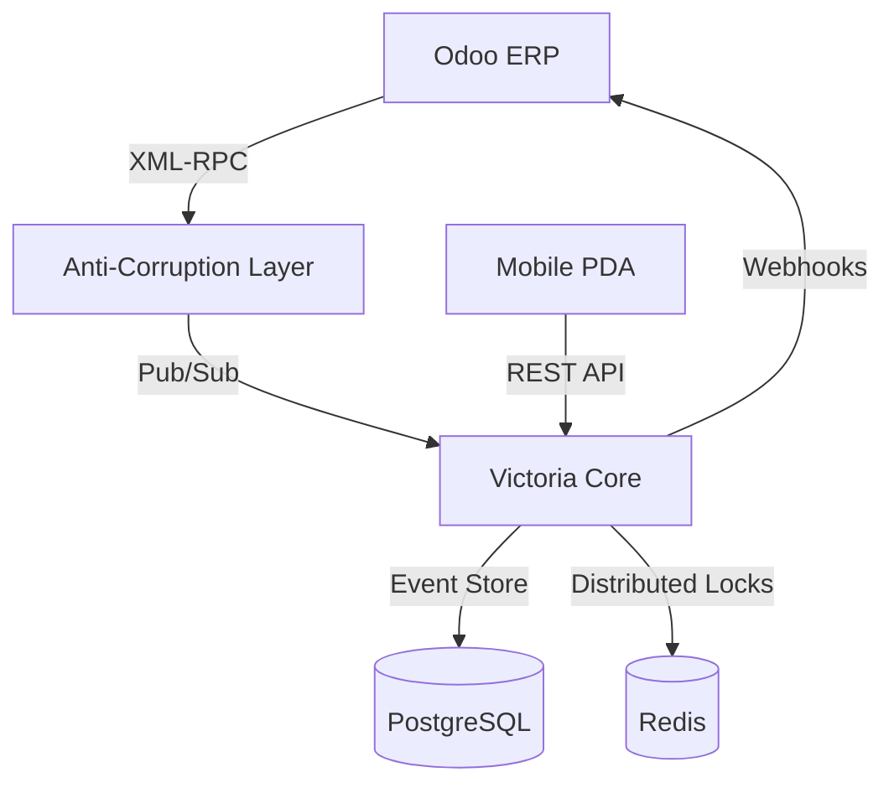

# Victoria WMS Core v1.0 🚀

[](https://github.com/JoseChansing/Victoria-WMS-Core)
[](./docs/architecture/ADR-001-event-sourcing.md)
[](./docs/architecture/ADR-004-multi-tenancy.md)
[](./docs/architecture/ADR-003-odoo-integration.md)

**Victoria WMS** es un motor de gestión de almacenes de próxima generación, diseñado para entornos multi-inquilino de alta velocidad. Combina la trazabilidad inmutable del **Event Sourcing** con la potencia de captura de datos de alta velocidad vía **RFID**.

## 🌟 Características Principales
- **Multi-Tenant Nativo**: Aislamiento físico y lógico de inventarios por cliente (`TenantGuard`).
- **RFID Ready**: Decodificación de EPC (SGTIN-96) y filtrado de ráfagas (`Burst Filter`) integrado.
- **Arquitectura de Resiliencia**: Anti-Corruption Layer (ACL) para integraciones robustas con Odoo ERP vía XML-RPC.
- **Inmutabilidad Logística**: Registro de cada movimiento como un evento de dominio auditable.

## 🛠️ Tech Stack
- **Backend**: .NET 8 (C#), Marten (PostgreSQL Event Store), Redis (Lock Manager).
- **Messaging**: Async IMessageBus (InMemory for SIT / RabbitMQ-ready).
- **ERP**: Odoo Integration (XML-RPC Physical Adapter).
- **Mobile**: Flutter/Dart PDA Snippets para operaciones de piso.

## 🏗️ Arquitectura del Sistema



## 🚀 Quick Start (Docker Simulator)

Levanta el entorno completo (Core + Redis + Postgres + ERP Simulator) con un solo comando:

```bash
docker-compose up -d
```

## 👨‍💻 Desarrollo Local (Localhost)

Si deseas ejecutar el código fuente localmente (**Backend y Frontend**) para depuración:

### 1. Infraestructura (BD + Redis)
Levanta solo la base de datos y caché:
```bash
docker-compose -f docker-compose.local.yml up -d
```

### 2. Backend (API)
Es CRÍTICO ejecutar en modo `Development` para ver errores detallados y habilitar Swagger.
**Nota:** La API *debe* escuchar en el puerto `5242` (`http://localhost:5242`) para que el Frontend Proxy funcione. Si inicia en el puerto 5000, verifica que exista el archivo `Properties/launchSettings.json`.

```bash
cd src/Victoria.API
dotnet run --environment Development
```
*La API escuchará en: `http://localhost:5242`*

### 3. Frontend (UI)
```bash
cd src/Victoria.UI
# cmd /c "npm run dev" (si usas Windows/CMD)
npm run dev
```
*La UI escuchará en: `http://localhost:5173`*

### 4. Solución de Problemas Comunes

**🔴 Error 500 / 502 Bad Gateway en Frontend**
- **Causa**: El Backend inició en el puerto incorrecto (5000 en lugar de 5242).
- **Solución**:
  1. Detén el backend (`Ctrl+C`).
  2. Asegúrate de que existe `src/Victoria.API/Properties/launchSettings.json`.
  3. Ejecuta `dotnet run` (sin argumentos) o `dotnet run --launch-profile http`.
  4. Verifica que la consola diga: `Now listening on: http://localhost:5242`.

**🔴 Connection Refused (localhost ha rechazado la conexión)**
- **Causa**: El servidor de Frontend (Vite) no está corriendo.
- **Solución**:
  1. Ve a `src/Victoria.UI`.
  2. Ejecuta `npm run dev`.
  3. Verifica que la consola diga: `Local: http://localhost:5173/`.

## 📚 Documentación Técnica
- [Architecture Decision Records (ADRs)](./docs/architecture/README.md)
- [Guía de Operación & Troubleshooting](./docs/operation/troubleshooting.md)

---
Desarrollado con ❤️ para logística de alto impacto.
