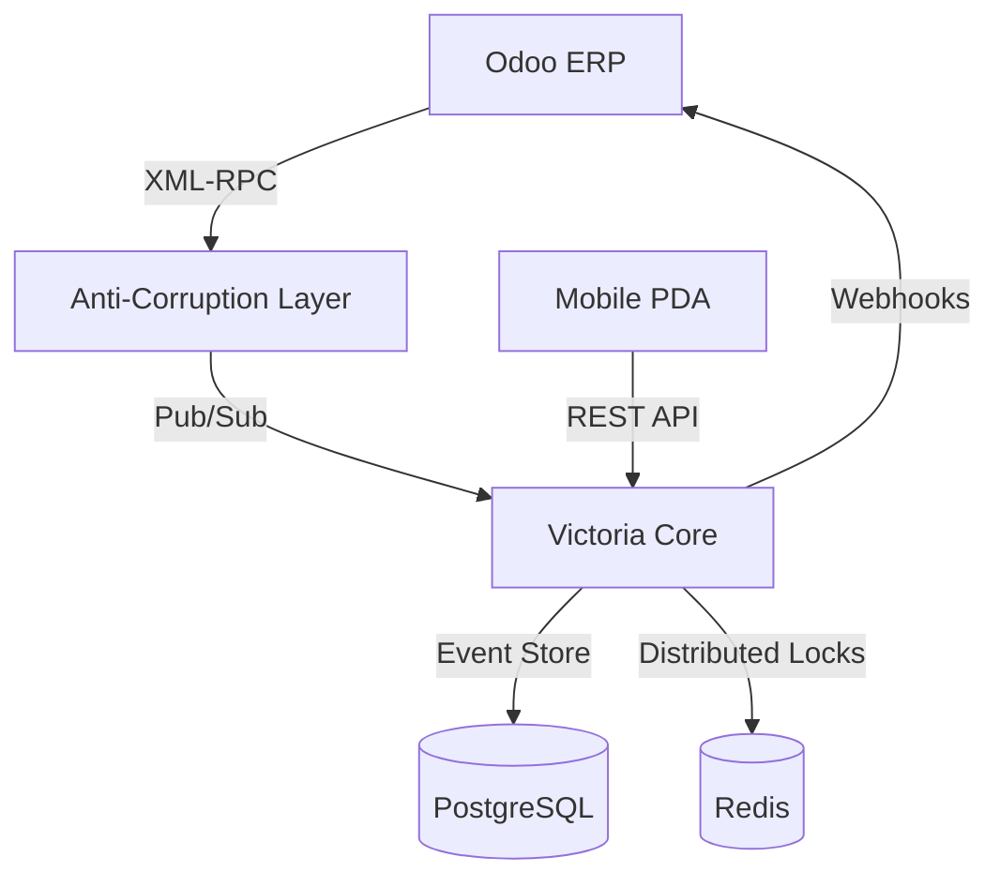

# Victoria WMS Core v1.0 🚀

[](https://github.com/JoseChansing/Victoria-WMS-Core)
[](./docs/architecture/ADR-001-event-sourcing.md)
[](./docs/architecture/ADR-004-multi-tenancy.md)
[](./docs/architecture/ADR-003-odoo-integration.md)

**Victoria WMS** es un motor de gestión de almacenes de próxima generación, diseñado para entornos multi-inquilino de alta velocidad. Combina la trazabilidad inmutable del **Event Sourcing** con la potencia de captura de datos de alta velocidad vía **RFID**.

## 🌟 Características Principales
- **Multi-Tenant Nativo**: Aislamiento físico y lógico de inventarios por cliente (`TenantGuard`).
- **RFID Ready**: Decodificación de EPC (SGTIN-96) y filtrado de ráfagas (`Burst Filter`) integrado.
- **Arquitectura de Resiliencia**: Anti-Corruption Layer (ACL) para integraciones robustas con Odoo ERP vía XML-RPC.
- **Inmutabilidad Logística**: Registro de cada movimiento como un evento de dominio auditable.

## 🛠️ Tech Stack
- **Backend**: .NET 8 (C#), Marten (PostgreSQL Event Store), Redis (Lock Manager).
- **Messaging**: Async IMessageBus (InMemory for SIT / RabbitMQ-ready).
- **ERP**: Odoo Integration (XML-RPC Physical Adapter).
- **Mobile**: Flutter/Dart PDA Snippets para operaciones de piso.

## 🏗️ Arquitectura del Sistema



## 🚀 Quick Start (Docker Simulator)

Levanta el entorno completo (Core + Redis + Postgres + ERP Simulator) con un solo comando:

```bash
docker-compose up -d
```

### Primeros Pasos
1. **Sync Maestros**: POST `/simulate/odoo/sync-product`.
2. **Recepción**: POST `/api/v1/inventory/receipt`.
3. **Audit**: GET `/api/v1/rfid/audit`.

## 📚 Documentación Técnica
- [Architecture Decision Records (ADRs)](./docs/architecture/README.md)
- [Guía de Operación & Troubleshooting](./docs/operation/troubleshooting.md)

---
Desarrollado con ❤️ para logística de alto impacto.
